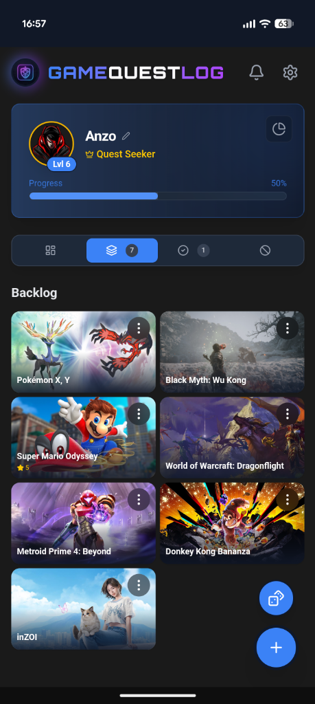
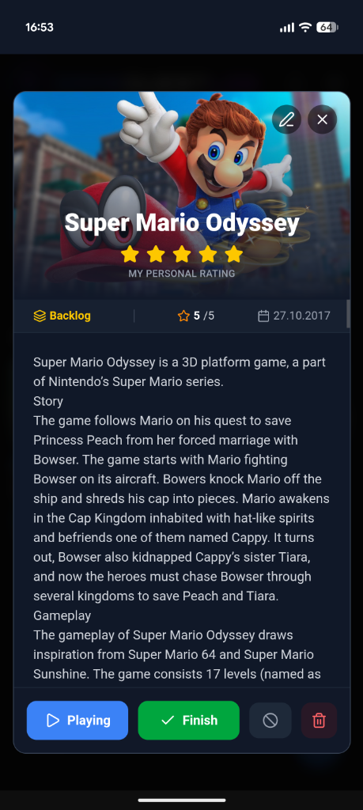

# GameQuestLog 🎮

> **Your personal gaming odyssey.** A modern, gamified way to track your video game collection, progress, and achievements.

<p align>
  
  
  
  
</p>

## ✨ About The Project

GameQuestLog is not just a list—it's a **companion for your gaming journey**. Built with a premium, dark-mode-first design philosophy, it transforms the mundane task of backlog management into an engaging RPG-like experience.

Earn XP for every game you add, start, or finish. Level up your profile from a "Novice Adventurer" to a "Godlike Entity" as you conquer your library.

### Key Features

*   **🏆 Gamified Progression**: Earn XP and level up by managing your library. Watch your rank grow!
*   **📊 Comprehensive Dashboard**: Visualize your habits with beautiful charts (Playing vs. Completed, Genre DNA, Platform Wars).
*   **🧙‍♂️ Quest Giver**: Can't decide what to play? Let the "Quest Giver" roll the dice and pick a game from your backlog.
*   **📱 Mobile-First PWA**: Installable on iOS and Android. Features native-like smooth gestures (swipe-to-close) and touch-optimized UI.
*   **🎨 Dynamic Themes**: Customize the look with multiple color schemes (Blue, Pink, Green, Purple, Red, Orange).
*   **🪄 AI-Powered Updates**: Integrated with **Google Gemini** to fetch the latest patch notes and content updates for your active games.
*   **💾 Local & Private**: 100% Client-side. Your data lives in your browser's LocalStorage. Support for JSON Import/Export backups.
*   **🔍 RAWG API Integration**: Instant access to a massive database of games for cover art, metadata, and ratings.

---

## 🛠️ Built With

*   **[Vue 3](https://vuejs.org/)** (Composition API) - The Progressive JavaScript Framework
*   **[Vite](https://vitejs.dev/)** - Next Generation Frontend Tooling
*   **[Tailwind CSS](https://tailwindcss.com/)** - Utility-first CSS framework
*   **[Chart.js](https://www.chartjs.org/)** - For beautiful data visualization
*   **[Lucide Icons](https://lucide.dev/)** - Beautiful & consistent icons
*   **[Google Generative AI](https://ai.google.dev/)** - For smart game updates

---

## 🚀 Getting Started

To get a local copy up and running, follow these simple steps.

### Prerequisites

*   Node.js (v18 or higher)
*   npm

### Installation

1.  **Clone the repository**
    ```bash
    git clone https://github.com/Anzo1986/GameQuestLog.git
    cd GameQuestLog
    ```

2.  **Install dependencies**
    ```bash
    npm install
    ```

3.  **Get a RAWG API Key**
    *   Sign up at [RAWG.io](https://rawg.io/apidocs) (It's free).
    *   Enter your API key in the application settings (gear icon) after launching.

4.  **Run Development Server**
    ```bash
    npm run dev
    ```

5.  **Build for Production**
    ```bash
    npm run build
    ```

---

## 📱 Mobile Installation (PWA)

Experience the app like a native mobile application:

1.  **Deploy** the app (e.g., via Vercel or Netlify) or run locally on your network.
2.  Open in **Chrome (Android)** or **Safari (iOS)**.
3.  Tap **"Add to Home Screen"** in the share menu.
4.  Enjoy the fullscreen, immersive experience!

---


## 📱 Smartphone Previews

<p align="center">
  
  
  
</p>

---

## 📝 License

Distributed under the MIT License. See `LICENSE` for more information.

---

<p align="center">
  Built with ❤️ by Raphael
</p>
