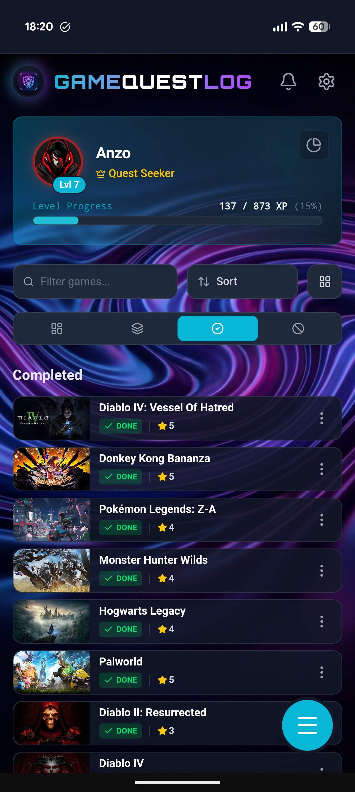
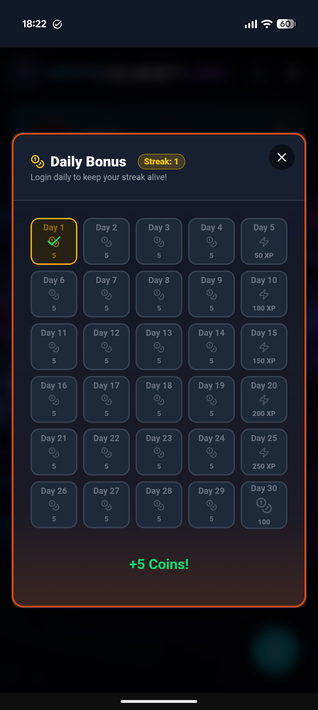
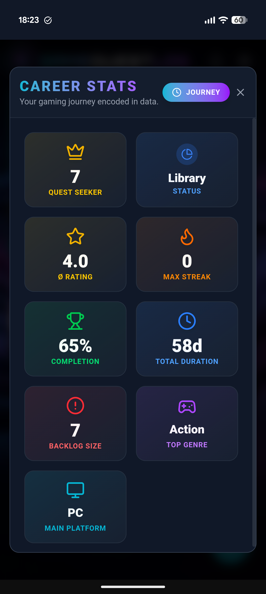

# GameQuestLog 🎮

> **Your personal gaming odyssey.** A modern, gamified way to track your video game collection, progress, and achievements.

<p align>
  
  
  
  
</p>

## ✨ About The Project

GameQuestLog is not just a list—it's a **companion for your gaming journey**. Built with a premium, dark-mode-first design philosophy, it transforms the mundane task of backlog management into an engaging RPG-like experience.

Earn XP for every game you add, start, or finish. Level up your profile from a "Novice Adventurer" to a "Godlike Entity" as you conquer your library.

## 🚀 Key Features

### 🎮 Gamification & Progression
*   **XP System**: Earn experience points for every gaming activity.
*   **Leveling**: Progress through 50+ levels with unique rank titles.
*   **Achievements**: Unlock **64 unique achievements** across Bronze, Silver, Gold, and Platinum tiers.
*   **Streaks**: Track your **Daily Login Streak** and beat your all-time **Max Streak**.

### 🤖 AI Integration ("The Oracle")
*   **Manual AI Prompts**: Generate optimized prompts to paste into ChatGPT/Claude/Gemini.
*   **Update Finder**: Instantly generate prompts to find patch notes and DLC for your playing/backlog games.
*   **Sequel Scout**: Find sequels or prequels to your top-rated games.
*   **Smart Recommendations**: Get game suggestions based on "Vibe", with optional **Hidden Gems Mode** (no AAA) and **Spoiler Shield**.

### ☁️ Data Privacy
*   **Local First**: Your data lives in your browser by default for privacy and speed.
*   **Export/Import**: Manual JSON backup options available to safeguard your progress.

### 📊 Statistics & Insights
*   **Career Stats**: A comprehensive dashboard of your gaming habits.
*   **Visual Charts**: Interactive Doughnut, Radar, and Bar charts for Genre DNA, Platform Wars, and Library Status.
*   **Gamer Card**: Generate a high-quality, shareable image of your profile stats to show off social media.

### 🎨 Premium UI/UX
*   **Glassmorphism**: Modern, translucent UI aesthetics.
*   **3D Tilt Effects**: Holographic card effects that react to your mouse movement.
*   **Themes**: Customize the app with various color themes (Cyberpunk, Royal, Ocean, etc.).
*   **Mobile Optimized**: Swipe gestures for navigation, haptic feedback, and a PWA installable experience.

---

## 🛠️ Built With

*   **[Vue 3](https://vuejs.org/)** (Composition API)
*   **[Vite](https://vitejs.dev/)**
*   **[Tailwind CSS](https://tailwindcss.com/)**
*   **[Lucide Icons](https://lucide.dev/)**
*   **[Chart.js](https://www.chartjs.org/)**

---

## 🚀 Getting Started

1.  **Clone the repository**
    ```bash
    git clone https://github.com/Anzo1986/GameQuestLog.git
    cd GameQuestLog
    ```

2.  **Install dependencies**
    ```bash
    npm install
    ```

3.  **Run Development Server**
    ```bash
    npm run dev
    ```

4.  **Build**
    ```bash
    npm run build
    ```

---

## 📱 Mobile Installation (PWA)

Experience the app like a native mobile application:

1.  **Deploy** the app (e.g., via Vercel or Netlify) or run locally on your network.
2.  Open in **Chrome (Android)** or **Safari (iOS)**.
3.  Tap **"Add to Home Screen"** in the share menu.
4.  Enjoy the fullscreen, immersive experience!

---

## 📱 Smartphone Previews

<div style="display: flex; overflow-x: auto; gap: 10px; padding-bottom: 10px;">
  
  
  
  
  
  
  
  
  
  
</div>
